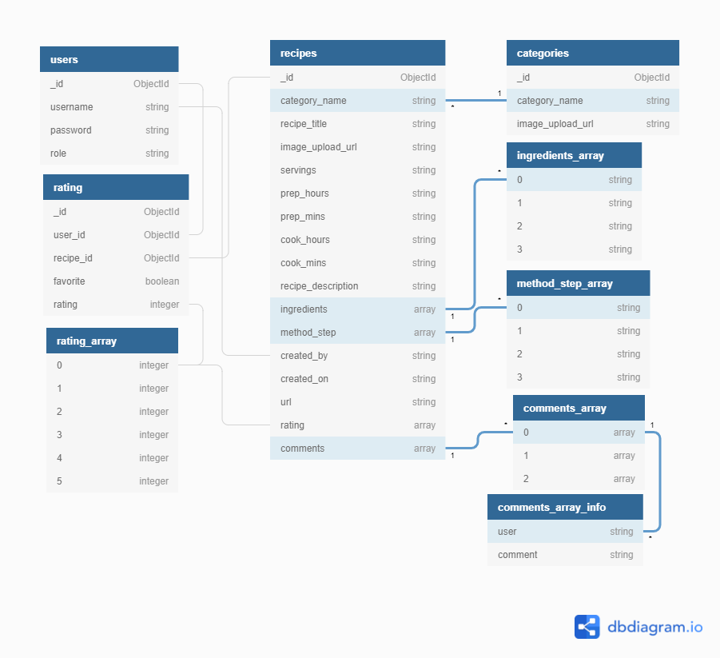

# **Wanderlust Recipes** - by Russell Oakham

## **Project overview**

'Wanderlust Recipes' is a community-focused website, where user accounts can create, share and review recipe ideas.

The site is created to engage users of all ages and backgrounds, so is branded in a light, clean and neutral style. Additionally, the term 'Wanderlust' is defined as a ['lust for wandering'](https://www.merriam-webster.com/dictionary/wanderlust), so styling elements have been chosen to promote curiosity and exploration.

I have used HTML, CSS, JavaScript and Python to build the site, ensuring it is fully responsive to user interaction on their chosen device.

## **Deployed site**
The live website can be found at the following link; [Wanderlust Recipes](https://wanderlust-recipes.herokuapp.com/).


## **Table of Contents**

* [**Deployed site**](#deployed-site)
  * [1. **UX**](#1-ux)
    + [**User Stories**](#user-stories)
    + [**Structure**](#structure)
    + [**Skeleton**](#skeleton)
    + [**Surface**](#surface)
      - [**Colour & Styling**](#colour--styling)
      - [**Language/Tone**](#languagetone)
      - [**Styling Considerations**](#styling-considerations)
  * [2. **Features**](#2-features)
    + [**Existing Features**](#existing-features)
    + [**Features to consider implementing in future**](#features-to-consider-implementing-in-future)
  * [3. **Database Design**](#3-database-design)
    + [**Indexes**](#indexes)
      - [**Recipes**](#recipes)
    + [**Queries**](#queries)
      - [**Browsing**](#browsing)
      - [**Users**](#users)
      - [**Searching**](#searching)
      - [**Uploading**](#uploading)
  * [4. **Technologies Used**](#4-technologies-used)
  * [5. **Testing**](#5-testing)
  * [6. **Deployment**](#6-deployment)
    + [Database Deployment](#database-deployment)
    + [Application Hosting](#application-hosting)
    + [**Heroku**](#heroku)
      - [Creating a Heroku app](#creating-a-heroku-app)
      - [Setting Environmental Variables](#setting-environmental-variables)
      - [Deployment](#deployment)
      - [Automatic Deployment](#automatic-deployment)
    + [GitHub and GitPod repository management](#github-and-gitpod-repository-management)
    + [**How to clone 'Wanderlust Recipes' in GitHub and GitPod.**](#how-to-clone-wanderlust-recipes-in-github-and-gitpod)
  * [7. **Credits**](#7-credits)
    + [**Design and research**](#design-and-research)
    + [**Technical**](#technical)
    + [**Content**](#content)
    + [**Media**](#media)
      - [Recipe Category Images:](#recipe-category-images)
      - [404 Error Page](#404-error-page)
    + [**Acknowledgements**](#acknowledgements)

## 1. **UX**

Overview of UX design decisions, including examples of websites I have viewed as part of research and inspiration.

### **User Stories**

<details>
<summary>Browsing</summary>

* \(US001\) - As a user I want the website to clearly display recipe suggestions to me so I can be introduced to new content.
* \(US002\) - As a user I want to see recipe reviews and comments from other users, so I am informed of the best recipes.
</details>
<details>
<summary>Searching</summary>

* \(US003\) - As a user, I want to be able to view recipes by category, so I can find recipes of specific type I would like to make.
* \(US004\) - As a user, I want to be able to search recipes by keyword, so I can find recipes easily, for example by name or by included ingredient.
* \(US005\) - As a user, I want to be able to search and filter recipes by rating, so I can find only the highest-rated recipes to choose from.
* \(US006\) - As a user, I want to be able to search and filter recipes by serving size, so I can find recipes suited to the number of people I am catering to.
* \(US007\) - As a user, I want to be about to save my favourite recipes, so I can quickly find them again in future.
</details>

<details>
<summary>Uploading Recipes</summary>

* \(US008\) - As a user, I want to be able to upload my own recipes, so other users can benefit from them.
* \(US009\) - As a user, I want to gain feedback on the recipes I upload, so I can determine improvements.
* \(US010\) - As a user, I want to be able to edit and improve recipes I have already uploaded.
</details>

<details>
<summary>Users</summary>

* \(US011\) - As a user, I want to be able to register with the site, so I can upload and edit recipes, plus save my favourite recipes.
* \(US012\) - As a registered user, I want to be able to login to my account, so I can access and edit my recipes, and find my favourite recipes.
* \(US013\) - As a registered user, I want to be able to submit ratings and reviews for recipes submitted by other users.
</details>

<details>
<summary>Administration</summary>

* \(US014\) - As an admin I want to be able to edit content, to ensure it adheres to site rules.
* \(US015\) - As an admin I want to be able to add and edit food categories, to continuously improve user experience.
</details>

<details>
<summary>General</summary>

* \(US016\) - As a user I want to recieve clear feedback for my actions on the site, so I know they are complete or if further steps are needed.
</details>
&nbsp;

### **Structure**
Overview of site and page structure, explaining functionality and purpose.

<details><summary>Home Page:</summary>

  * _Header/Footer_: For easy navigation across the site and to external resources such as social media pages.
  * _Website Logo_: To easily identify the 'Wanderlust Recipes' site branding.
  * _Recipe Cards_: To easily provide users key information on featured recipes, including visual image, short description, user rating, serving size and prep/cook times.
  * _Search Bar_: Text input bar, allowing users to search recipes by keyword, category, time requirement and minimum rating.
   * _Search Results_: Once user search input, latest recipes replaced by recipe cards matching the search query.
  * _Pagination_: Page is paginated after 10 recipes are displayed, to ensure quick page load and easy user navigation.
  </details>

<details><summary>Recipe Page:</summary>

  * _Recipe Image_: Provides users a visual of the final recipe, to entice users to create it themselves.
  * _Recipe Title_: Provides users with the name of the dish, indicating the style and main ingredients of the dish.
  * _Star Rating_: Provides users visual feedback regarding how highly other users have rated the recipe.
  * _Preparation & Cooking Time_: Provides users information regarding time requirement to prepare the recipe.
  * _Serving Size_: Provides users information on the serving size the recipe creates, allowing users to adjust ingredient amounts to their own judgement.
  * _Ingredient List_: Provides users with a list of all ingredients and measures needed to complete the recipe.
  * _Method_: Provides users step-by-step method for creating the dish.
  </details>

<details><summary>User Login / Registration Page:</summary>

  * _Username Input_: Text input box, allowing users to enter their username.
  * _Password Input_: Text input box, allowing users to enter their password.
  * _Password Confirmation (Registration)_ : Text input box, must match password input, to ensure user does not incorrectly type password while registering.
  * _Submit / Cancel_: Buttons allowing users to submit entered information, or cancel and restart.
  </details>

<details><summary>User Profile Page:</summary>

  * _Username Banner_: Banner displaying the username of logged in account, allowing users to quickly identify if they are logged into their correct desired account.
  * _Recipes Submitted_: All historical recipes uploaded by the user displayed in list format, allowing users to easily access their owned recipes for review or edit.
  * _Favourite Recipes_: All favourited recipes are displayed in list format, allowing users quick access.
  </details>

<details><summary>New Recipe Page:</summary>

  * _Input areas for below recipe data points_:
    * Recipe Name - Text
    * Recipe Image - File upload and preview
    * Serving Size - As numeric input
    * Preparation Time - As numeric input
    * Cooking Time - As numeric input
    * Recipe Category Selection - Drop down menu
    * Recipe Description: Textbox of 25 to 160 characters
    * Ingredients - List text input
    * Recipe Steps - List text input
    </details>

<details>
<summary>Edit Recipe Page:</summary>

Inputs are pre-populated with historic recipe information.
  * _Input areas for below recipe data points_:
    * Recipe Name - Text
    * Recipe Image - File upload and preview
    * Serving Size - As numeric input
    * Preparation Time - As numeric input
    * Cooking Time - As numeric input
    * Recipe Category Selection - Drop down menu
    * Recipe Description: Textbox of 25 to 160 characters
    * Ingredients - List text input
    * Recipe Steps - List text input
</details>

<details>
<summary>Manage Categories Page:</summary>

Page visible only to users with role of 'admin'.
  * Add Category - Button, leading to 'Add Category' page.
  * Category Tiles - Visual tiles representing each Recipe Category added to the site.
  * Edit Category - Button, leading to 'Edit Category' page.
</details>

<details>
<summary>Add Category Page:</summary>

Page visible only to users with role of 'admin'.
  * _Input areas for below category data points_:
    * Category Name - Text
    * Category Image - File upload and preview.
    * Add Category - Submit Button
</details>

<details>
<summary>Edit Category Page:</summary>

Page visible only to users with role of 'admin', input's pre-populated with historic category information.
  * _Input areas for below category data points_:
    * Category Name - Text
    * Category Image - File upload and preview.
    * Add Category - Submit Button
</details>
&nbsp;
### **Skeleton**

At this point I began creating wireframes, using the above structure considerations. I used [Balsamiq](https://balsamiq.com/) these below;

* [Home page on desktop and mobile](assets/wireframes/home-page.png)
* [Recipe Page](assets/wireframes/recipe-page.png)
* [Profile Page](assets/wireframes/profile-page.png)
* [Add Recipe Page](assets/wireframes/add-recipe-page.png)
* [Login / Registration Page](assets/wireframes/login-registration-page.png)

### **Surface**

This is the sensory design section of a website, or how it looks, feels and sounds.

#### **Colour & Styling**

Upon deciding to brand the website as 'Wanderlust Recipes' I found [this](static/images/wanderlust-whitebg.png) logo on Shutterstock. The logo comprises white and blue colours, which give a light and clean aesthetic. With this in mind I consulted [this article](https://elearningindustry.com/the-elearning-color-guide-evoking-the-right-emotion) on how colours evoke emotions, wishing to promote feelings of calm, optimism, energy, nature and creativity, I chose to use a colour palette consisting of whites, blues and greens.

I used the website [image color picker](https://imagecolorpicker.com/), to determine the blue used in the logo is Gunmetal (#1E2B3A). I then used the website [Coolers](https://coolors.co/) to generate the rest of my colour palette, using Gunmetal (#1E2B3A) as the starting colour and finding additional colours in fitting the style I wished to achieve. 

The resulting palette is below;


<details>
<summary>Colour Palette</summary>

* Gunmetal - #1E2B3A
* Indigo Dye - #213F61
* Metallic Seaweed - #077787
* Y in Mn Blue - #38506C 
* Light Sea Green - #2BBBAD
</details>

I also used a selection of off-white and off-black colours to provide additional accenting to general white/black website elements, such as backgrounds and fonts.

#### **Language/Tone**

I wanted the language to reflect a casual and fun atmosphere, reflecting a backpackers lifestyle. Therefore content was written in this style, avoiding technical or formal language where possible.

Similarly, I wanted to use fonts that reinforce the casual identity of the site and also be easy to read. To achieve this I used two [Google Fonts](https://fonts.google.com/);

* [Roboto](https://fonts.google.com/specimen/Roboto) - A font that promotes natural reading rhythm.
* [Open Sans](https://fonts.google.com/specimen/Open+Sans) - A humanist sans serif, designed for excellent legibility with a neutral, yet friendly appearance.
* Sans-serif - Web safe font, used if primary two fonts fail to load.

#### **Styling Considerations**

Before beginning development, I listed some styling ideas that I felt benefit the website. The majority of these can be seen in the wireframes.

* Favicon: Desktop and Mobile.
* Navigation
  * Sticky top
  * Mobile: 'Burger' menu icon, expanding on click.
  * Logo: Navigates to the home page on click.
* Recipe Cards:
  * Visual Image showing final recipe dish, to entice users to select.
* Recipe Pages:
  * Icons: Icons used to highlight key recipe info, serving size, preparation time, rating.
  * Ingredients & Method - Displayed in tabular format, which user can dynamically choose between via click or swipe.

## 2. **Features**
The site allows users to upload new recipes and edit existing ones. Users can search for recipes based on name, description, recipe type, number of servings and minimum rating. Users can favourite recipes, which are displayed on their profile page. Users can also rate others users submitted recipes and comment their feedback.

### **Existing Features**
<details>
<summary>The Header:</summary>

* **Website Logo**: Builds brand awareness amongst users.
* **Navigation Bar**: Allows users to navigate the site easily and intuitively, as well as login/register their account.
</details>

<details>
<summary>The Footer:</summary>

* **Website Developer**: Copyright information for website developer brand awareness.
* **Developer Social Links**: Links to GitHub and LinkedIn of website developer for brand awareness.
* **Business Social Links**: Links to company social media sites, to raise brand awareness.

Both the Header and Footer are present and consistent on all website pages.
</details>

<details>
<summary>Home page:</summary>

* **Image Banner**: Visually pleasing design, allowing users to immediately identify the site brand.
* **Latest Recipes**: List of latest recipes submitted to the site, showing key information; recipe image, type, rating, preparation time and serving size.
* **Search Bar**: Allows user to enter keywords to search recipe database
* **Advanced Search**: Allows user to enter additional search criteria; recipe type, minimum rating, serving size.
* **Search Results**: Replace latest recipes when search is submitted. Recipe cards displayed as search return results.
</details>

<details>
<summary>Login / Registration page:</summary>

* **Username Input**: Input area for users to enter their profile username.
* **Password**: Input area for users to enter their profile password.
* **Confirm Password** (Registration page): Input area for users to confirm password, must match password input for successful registration.
* **Cancel**: Cancellation button, clearing input text allowing users to refill entries.
* **Login/Registration Button**: Button allowing users to login to their account or register for a new account.
</details>

<details>
<summary>User Profile page:</summary>

* **Image Banner**: Visually pleasing design, allowing users to immediately identify the site brand.
* **Username sub-banner**: Text banner showing username of logged in account, allowing users to quickly identify if they are using their correct desired account.
* **Favourite Recipes**: Recipes favourited by the user are displayed in list order, allowing quick and easy access.
* **Submitted Recipes**: Recipes previously submitted by the user are displayed in list order, allowing users quick and easy access to review or edit.
</details>

<details>
<summary>New Recipe page:</summary>

* **Input areas for below recipe data points**:
    * _Recipe Name_ - Text
    * _Recipe Image_ - File upload and preview
    * _Serving Size_ - Numeric
    * _Preparation Time_ - hh:mm as drop down menus
    * _Cooking Time_ - hh:mm as drop down menus
    * _Recipe Category Selection_ - drop down menu
    * _Recipe Description_: Textbox of 25 to 160 characters
    * _Ingredients_ - List text input
    * _Recipe Steps_ - List text input
</details>
&nbsp;

### **Features to consider implementing in future**
As this is a community-focused platform, several future features would be worth considering implementation:
* **Social Media Sharing** - Allow users to share recipes directly to their social media accounts.
* **Nutritional Information API Integration** - Integrate the platform to a third-party API that automatically calculates the nutritional information of recipes based on their ingredients and serving size. This would be highly beneficial to health-conscious users.
* **Vegetarian/Vegan Alternative Recipes** - Allow users to enter Vegetarian or Vegan alternative ingredient lists and methods for existing recipes. Update recipe pages to allow users to choose an alternative option of the recipe and dynamically update the page contents in line with choice.
* **User Comment Section** - Allow users to comment on each other's recipes, allowing constructive feedback and additional context to reviews.
* **Optimised Image Delivery** - Page load speeds could be sped up via using compression on user-uploaded images, to ensure they are served in a fully optimised state. This could be achieved by further configuring the Cloudinary account to automatically compress images during upload.
* **User Administration** - Add user administration page, allowing admins to actions to manage users accounts e.g. suspend accounts, set other users to admin etc.
 
&nbsp;
## 3. **Database Design**
MongoDB was the database solution used for the website development, using the below, structured plan.



### **Indexes**

#### **Recipes**

<details>
<summary>1. Text index on recipe title, description and ingredients, allowing for text searches.</summary>

```
mongo.db.recipes.create_index([

  ("recipe_title", "text"),
  ("recipe_description", "text"),
  ("ingredients", "text")

  ])
```

</details>

### **Queries**

#### **Browsing**

<details>
<summary>1. Find the latest recipes:</summary>

```
list(
  mongo.db.recipes.find().sort("created_on", -1)
  )
```

</details>

#### **Users**
<details>
<summary>1. Find a specific user account based on username:</summary>

```
mongo.db.users.find_one(
        {"username": username}
    )
```

</details>

<details>
<summary>
2. Insert a new user record into the database, with a defined username, password and user role:
</summary>

```
register = {
            "username": request.form.get("username").lower(),
            "password": generate_password_hash(request.form.get("password")),
            "role": "user"
        }
        mongo.db.users.insert_one(register)
```

</details>

<details>
<summary>3. Find all recipes uploaded by the session user:</summary>

```
recipes = list(mongo.db.recipes.find(
                {"created_by": username}).sort("created_on", -1))
```

</details>

<details>
<summary>4. Find all recipes favourited by the session user:</summary>

```
favorites = list(mongo.db.rating.aggregate([
                {"$match": {"user_id": user['_id'], 'favorite': True}},
                {
                    "$lookup": {
                        "from": "recipes",
                        "localField": "recipe_id",
                        "foreignField": "_id",
                        "as": "favorites"
                    }
                },
                {"$unwind": "$favorites"},
                {"$replaceRoot": {"newRoot": "$favorites"}}
            ]))
```

</details>

#### **Searching**
<details>
<summary>
1. Find a single recipe from its recipe title:
</summary>

```
recipe = mongo.db.recipes.find_one({"url": recipe_title})
```

</details>

<details>
<summary>
2. Find recipes conforming to a user inputted search criteria:
</summary>

```
def search():
    query = {}
    form_query = []

    if request.method == "POST":
        # Construct the search query with {key: value}
        if "search-text" in request.form and request.form["search-text"]:
            query["$text"] = {
                "$search": request.form["search-text"],
                "$caseSensitive": False,
            }
            form_query.append({
                "key": "search-text",
                "value": request.form["search-text"]
            })

        if "category_name" in request.form and request.form["category_name"]:
            query["category_name"] = request.form["category_name"]
            form_query.append({
                "key": "category_name",
                "value": request.form["category_name"]
            })

        if "servings" in request.form and request.form["servings"]:
            query["servings"] = request.form["servings"]
            form_query.append({
                "key": "servings",
                "value": request.form["servings"]
            })

        if "rating-search" in request.form and int(
                request.form["rating-search"]) > 0:
            minRating = int(request.form["rating-search"])
            query["rating"] = {"$gte": minRating}
            form_query.append({
                "key": "rating[0]",
                "value": request.form["rating-search"]
            })

    recipes = list(mongo.db.recipes.find(query).sort("created_on", -1))
```

</details>

#### **Uploading**
<details>
<summary>
1. Add a new recipe:
</summary>

```
def add_recipe():
    if request.method == "POST":
        new_recipe = {
            "category_name": request.form.get("category_name"),
            "recipe_title": request.form.get("recipe_title"),
            "image_upload_url": request.form.get("image_upload_url"),
            "servings": request.form.get("servings"),
            "prep_hours": request.form.get("prep_hours"),
            "prep_minutes": request.form.get("prep_minutes"),
            "cook_hours": request.form.get("cook_hours"),
            "cook_minutes": request.form.get("cook_minutes"),
            "recipe_description": request.form.get("recipe_description"),
            "ingredients": request.form.getlist("ingredients"),
            "method_step": request.form.getlist("method_step"),
            "created_by": session["user"],
            "created_on": request.form.get("created_on"),
            "url": request.form.get("recipe_title").replace(' ', '-').lower(),
            "rating": [3, 0, 0, 0, 0, 0]
        }
        mongo.db.recipes.insert_one(new_recipe)
```

</details>

<details>
<summary>
2. Edit an existing recipe:
</summary>

```
def edit_recipe(recipe_id):
    if request.method == "POST":
        historic_rating = mongo.db.recipes.find_one(
            {"_id": ObjectId(recipe_id)})["rating"]
        update_recipe = {
            "category_name": request.form.get("category_name"),
            "recipe_title": request.form.get("recipe_title"),
            "image_upload_url": request.form.get("image_upload_url"),
            "servings": request.form.get("servings"),
            "prep_hours": request.form.get("prep_hours"),
            "prep_minutes": request.form.get("prep_minutes"),
            "cook_hours": request.form.get("cook_hours"),
            "cook_minutes": request.form.get("cook_minutes"),
            "recipe_description": request.form.get("recipe_description"),
            "ingredients": request.form.getlist("ingredients"),
            "method_step": request.form.getlist("method_step"),
            "created_by": session["user"],
            "created_on": request.form.get("created_on"),
            "url": request.form.get("recipe_title").replace(' ', '-').lower(),
            "rating": historic_rating
        }
        mongo.db.recipes.update({"_id": ObjectId(recipe_id)}, update_recipe)
```

</details>

<details>
<summary>
3. Favourite a recipe:
</summary>
Form submitted via AJAX request to avoid reload of page, improving user experience

```
def ajax_recipe_favorite():
    # Ajax request from favorite checkbox toggle to update database
    favorite = ('favorite' in request.json)
    response = {
        "success": True,
        "flash": None,
        "response": favorite
    }

    # Check if user has already favorited recipe
    existing_interaction = mongo.db.rating.find_one({
        "user_id": ObjectId(session['userid']),
        "recipe_id": ObjectId(request.json['recipeId'])
    })

    # Update existing interaction
    if existing_interaction:
        mongo.db.rating.update_one(
            {"_id": existing_interaction['_id']}, {
                '$set': {"favorite": favorite}})

    else:
        # Create new interaction
        interaction = {
            "user_id": ObjectId(session['userid']),
            "recipe_id": ObjectId(request.json['recipeId']),
            "favorite": favorite,
            "rating": 0
        }
        mongo.db.rating.insert_one(interaction)

    return response
```

</details>

<details>
<summary>
4. Submit a rating to a recipe:
</summary>

```
if new_interaction is not None:
            result = mongo.db.rating.update_one(
                {"_id": new_interaction},
                {"$set": {"rating": new_rating}}
            )
        # If no record found creates new record with additional info
        else:
            result = mongo.db.rating.insert_one({
                "user_id": ObjectId(session['userid']),
                "recipe_id": ObjectId(request.json['recipeId']),
                "favorite": False,
                "rating": new_rating
            })
```

</details>

<details>
<summary>
5. Update a rating for a recipe:
</summary>

```
result = mongo.db.recipes.update_one(
        {"_id": ObjectId(request.json['recipeId'])},
        {
            "$set": {
                "rating.0": rating[0],
                "rating.{i}".format(i=new_rating): int(rating[new_rating]),
                "rating.{i}".format(i=old_rating): int(rating[old_rating])
            }
        })
```

</details>

<details>
<summary>
6. Comment on a recipe:
</summary>

```
if "comment" in request.json and len(request.json["comment"]) > 0:
        comment = {
            "author": session["user"].capitalize(),
            "text": request.json['comment']
        }
        mongo.db.recipes.update_one(
            {"_id": ObjectId(request.json['recipeId'])},
            {"$push": {"comments": comment}}
            )
```

</details>

#### **Deletion**
<details>
<summary>
1. Delete a Recipe:
</summary>

```
mongo.db.recipes.remove({"_id": ObjectId(recipe_id)})
flash("Recipe Successfully Deleted")
```

</details>

<details>
<summary>
2. Delete a Category:
</summary>

```
mongo.db.categories.remove({"_id": ObjectId(category_id)})
flash("Category Successfully Deleted")
```

</details>

<details>
<summary>
3. Delete a historic comment on a recipe:
</summary>

```
if "comment" in request.json and "recipe" in request.json:
        index = int(request.json["comment"])
        mongo.db.recipes.update(
            {"_id": ObjectId(request.json['recipe'])},
            {"$unset": {"comments.{i}".format(i=index): None}}
        )
        mongo.db.recipes.update(
            {"_id": ObjectId(request.json['recipe'])},
            {"$pull": {"comments": None}}
        )
```

</details>
&nbsp;

## 4. **Technologies Used**

<details>
<summary>
Languages
</summary>
<ul>
<li><a href="https://en.wikipedia.org/wiki/HTML">HTML</a> - Programming language providing content and structure of the website.</li>
<li><a href="https://en.wikipedia.org/wiki/CSS">CSS</a> - Programming language providing styling of the website.</li>
<li><a href="https://en.wikipedia.org/wiki/JavaScript">JavaScript</a> - Programming language used for various interactive elements of the website, including game logic, audio options etc.</li>
<li><a href="https://en.wikipedia.org/wiki/Python_(programming_language)">Python</a> - Programming language used to drive core site functionality including user login and push/retrieving database information.</li>
<li><a href="https://en.wikipedia.org/wiki/Jinja_(template_engine)">Jinja</a> - Used to generate HTML from site templates</li>
</ul>
</details>

<details>
<summary>Libraries</summary>
<ul>
<li><a href="https://materializecss.com/">Materialize CSS Framework</a> - Library of pre-built HTML and CSS components, used for various aspects of the site, such as navigation bar.</li>
<li><a href="https://fontawesome.com/">Font Awesome</a> - Library used for icons, such as social links and other images.</li>
<li><a href="https://fonts.google.com/">Google Fonts</a> - Font style library.</li>
<li><a href="https://jqueryui.com/">jQuery</a> - JavaScript library used for simplification of JS scripts and DOM manipulation.</li>
<li><a href="https://flask.palletsprojects.com/en/1.1.x/">Flask</a> - Micro-framework to simplify Python scripting and web server tasks.</li>
<li><a href="https://werkzeug.palletsprojects.com/en/1.0.x/">Werkzeug</a> - Python library to manage user management integrity.</li>
</ul>
</details>

<details>
<summary>Editors</summary>
<ul>
<li><a href="https://github.com/">GitHub</a> - Remote code repository.</li>
<li><a href="https://gitpod.io/">GitPod</a> - IDE (Integrated Development Environment), for writing, editing and saving code.</li>
<li<a href="https://dbdiagram.io/">dbDiagram</a> - Used to plan and visualise database structure</li>
<li><a href="https://balsamiq.com/">Balsamiq</a> - Wireframes for visual design testing.</li>
</ul>
</details>

<details>
<summary>Tools</summary>
<ul>
<li><a href="https://cloudinary.com/">Cloudinary</a> - Plugin used for upload and hosting of user images</li>
<li><a href="https://pythonhosted.org/Flask-paginate/">Flask-Paginate</a> - Flask plugin, allowing easy pagination of recipe content page</li>
<li><a href="https://tinypng.com/">TinyPNG</a> & <a href="https://tinyjpg.com/">TinyJPG</a> -  Minimise image file sizes and maximise page load speed.</li>
<li><a href="https://www.remove.bg/">remove.bg</a> - Remove backgrounds from png images.</li>
<li><a href="https://coolors.co/">Coolers</a> - Color Palette Generation</li>
<li><a href="https://imagecolorpicker.com/">Image Color Picker</a> - Determine Hex code color in exisiting graphics</li>
<li><a href="https://realfavicongenerator.net/">Real Favicon Generator</a> - Generate favicons and icons for desktop and mobile usage.</li>
<li><a href="https://autoprefixer.github.io/">Autoprefixer</a> - Vendor prefixes to CSS rules.</li>
<li><a href="http://ami.responsivedesign.is/">Am I Responsive?</a> - Responsive design demo in ReadMe summary.</li>
<li><a href="https://www.responsivedesignchecker.com/">Responsive Design Checker</a> - Check website response across device types.</li>
<li><a href="https://www.lambdatest.com/">Lambdatest</a> - Check website response across device types.</li>
</ul>
</details>

<details>
<summary>Database Management</summary>
<ul>
<li><a href="https://www.mongodb.com/">MongoDB</a> - Cloud based database management system, used for storing user profile and recipe information.</li>
</ul>
</details>

<details>
<summary>Deployment Platform</summary>
<ul>
<li><a href="https://www.heroku.com/">Heroku</a> - Remote hosting platform, for hosting of python driven websites and applications.</li>
</ul>
</details>

&nbsp;
## 5. **Testing**

The testing process can be seen in the [TESTING.md](testing.md) document.

&nbsp;
## 6. **Deployment**

### Database Deployment

### Application Hosting
### **Heroku**

The site is hosted using [Heroku](https://www.heroku.com/), deployed directly from the master branch of GitHub. The deployed site will update automatically as new commits are pushed to the master branch.

#### Creating a Heroku app
- From the Heroku dashboard:
  - Select "New"
  - Select "Create new app"

    

- Add new app details to form:
  - Add app name (must be unique)
  - Select region
  - Click "Create App"

    

#### Setting Environmental Variables
- From the Heroku dashboard:
  - Select your app from the list

    

- Select "Settings" from the top menu:
  - Under 'Config Vars', select "Reveal Config Vars"
  - Add environment variables in key-value pairs, click "Add" to add additional pairings.

    

#### Deployment
- Create required deployment files in the repository:
  - requirements.txt
      - Lists the required python modules for Heroku to install.
    - To create:
      - In your IDE terminal, type: pip freeze > requirements.txt

  - Procfile
      -  Tells Heroku the command to launch the app.
    - To create:
      - in your IDE terminal, type: python app.py > Procfile

  - .gitignore (optional)
      - Lists files and directories which should be deployed to live app, such as files with environmental passkeys.
    - To create:
      - In your IDE terminal, type: touch .gitignore
      - List the files and directories to be excluded from live deployment, within the .gitignore file.
      - Save in your repository root directory.

- From the application top menu:
  - Select 'Deploy'
  - Choose your Deployment method:
    - Github:
      - Select the correct Github account.
      - Type in the repository name you wish to deploy.
      - Choose the correct repository from search results.
      - Select "Connect"

      

    - Manual Deployment:
      - Choose the correct branch you wish to deploy from the drop-down.
      - Select "Deploy Branch"
      - Heroku will return "Your App has successfully deployed". If this shows an error, troubleshooting will be needed.

      


#### Automatic Deployment
- From the application top menu:
  - Select 'Deploy'
  - Ensure app is connected to correct repository
  - Under 'Automatic Deployment' section:
    - Select 'Enable Automatic Deployment"

### GitHub and GitPod repository management

### **How to clone 'Wanderlust Recipes' in GitHub and GitPod.**

To run a version of the site locally, you can clone this repository using the following steps;

In a code editor of your choice;

1. Go to [GitHub.com](https://github.com/)
2. Click on 'Responsitories'
3. Click on 'Wanderlust Recipes'
4. Click on the 'Code' button.
5. Under 'HTTPS' click the clipboard icon to the right of the URL.
6. In your IDE of choice, open a repository or create a new repository.
7. Open Terminal \('Terminal' then 'New Terminal' from the top ribbon menu in GitPod.\)
8. Type 'git clone', paste URL link and press enter.

Additional information around these cloning steps can be found on [GitHub Pages Help Page](https://docs.github.com/en/github/creating-cloning-and-archiving-repositories/cloning-a-repository).
&nbsp;

## 7. **Credits**

### **Design and research**

The following are websites and articles that I used for reference and inspiration:
- [BBC Good Food](https://www.bbcgoodfood.com/)
- [Plum Recipes](https://plum-recipes.herokuapp.com/) - MS3 project by Sean Young
- [My food book](https://myfoodbook.com.au/)

### **Technical**

* [Real Favicon Generator](https://realfavicongenerator.net/) - For the generation of Favicon icons and code.
* [Materialize Docs](https://materializecss.com/getting-started.html) - For guidance on Materialize use and adaptations.
* [CSS-Tricks](https://css-tricks.com/) - For implementing CSS effects such as box-shadow.
* [w3Schools](https://www.w3schools.com/) - For checking proper syntax of HTML and CSS elements. 
* [Autoprefixer](https://autoprefixer.github.io/) - For generating CSS browser prefixes.
* [Stackoverflow](https://stackoverflow.com/) - For researching and troubleshooting JavaScript and Python code issues.
* [Miguel Grinberg](https://blog.miguelgrinberg.com/index) - For researching and troubleshooting Python functionality and code issues.
* [MongoDB Documentation](https://docs.mongodb.com/) - For researching and troubleshooting database code commands and issues.

### **Content**

All text content on the site was written originally by myself, with the below notes;

The recipe details, images and descriptions were obtained from [BBC Good Food](https://www.bbcgoodfood.com/) and uploaded by Russell Oakham

### **Media**

The photos and images used for this site were obtained.

* [**Shutterstock**](https://www.shutterstock.com/): From the following contributors;
  - [Wanderlust Logo](static/images/wanderlust.png) - [Sloth Astronaut](https://www.shutterstock.com/g/Sloth+Astronaut)
  - [New recipe image](static/images/new-recipe-image.jpg) - [Evgeny Karandaev](https://www.shutterstock.com/g/karandaev)

#### Recipe Category Images:
* [**Unsplash**](https://unsplash.com/): From the following contributors;
  - [Dessert](https://res.cloudinary.com/dolhmfgvf/image/upload/v1620742873/dessert_odmskl.jpg) - [Kobby Mendez](https://unsplash.com/@kobbyfotos)
  - [Pasta](https://res.cloudinary.com/dolhmfgvf/image/upload/v1620743238/pasta_njidyn.jpg) - [Danijela Prijovic](https://unsplash.com/@dacakockica)
  - [Breakfast](https://res.cloudinary.com/dolhmfgvf/image/upload/v1620743238/breakfast_eo1bpw.jpg) - [Ben Kolde](https://unsplash.com/@benkolde)
  - [Beef](https://res.cloudinary.com/dolhmfgvf/image/upload/v1620743238/beef_tog6ox.jpg) - [Charlie Solorzano](https://unsplash.com/@csolorzanoe)
  - [Chicken](https://res.cloudinary.com/dolhmfgvf/image/upload/v1620743238/Chicken_icnqmx.jpg) - [Mark DeYoung](https://unsplash.com/@tempestdesigner)
  - [Rice](https://res.cloudinary.com/dolhmfgvf/image/upload/v1620743655/rice_iarp59.jpg) - [Annie Spratt](https://unsplash.com/@anniespratt)
  - [Lamb](https://res.cloudinary.com/dolhmfgvf/image/upload/v1620743655/lamb_pmdjcl.jpg) - [Rumman Amin](https://unsplash.com/@rumanamin)
  - [Vegetarian](https://res.cloudinary.com/dolhmfgvf/image/upload/v1620743655/vegetarian_trkxik.jpg) - [Louis Hansel](https://unsplash.com/@louishansel)
  - [Soups](https://res.cloudinary.com/dolhmfgvf/image/upload/v1620743655/soup_dzzwdr.jpg) - [Nick Karvounis](https://unsplash.com/@nickkarvounis)
  - [Salads](https://res.cloudinary.com/dolhmfgvf/image/upload/v1620743655/salads_rugjgw.jpg) - [Yoav Aziz](https://unsplash.com/@yoavaziz)
  - [Pizza](https://res.cloudinary.com/dolhmfgvf/image/upload/v1620744157/pizza_vr42rd.jpg) - [Karthik Garikapati](https://unsplash.com/@karthikgarikapati)
  - [Noodles](https://res.cloudinary.com/dolhmfgvf/image/upload/v1620744157/noodles_dyegf7.jpg) - [Vita Marija Murenaite](https://unsplash.com/@runningvita)
  - [Pies](https://res.cloudinary.com/dolhmfgvf/image/upload/v1620744157/pies_hh6kbe.jpg) - [Priscilla Du Preez](https://unsplash.com/@priscilladupreez)
  - [Burgers](https://res.cloudinary.com/dolhmfgvf/image/upload/v1620744157/burger_qmp9cn.jpg) - [Niklas Rhöse](https://unsplash.com/@blitzer)
  - [Mince](https://res.cloudinary.com/dolhmfgvf/image/upload/v1620744157/mince_nffp3b.jpg) - [The Creative Exchange](https://unsplash.com/@thecreative_exchange)
  - [Turkey](https://res.cloudinary.com/dolhmfgvf/image/upload/v1620744726/turkey-2_rhoksz.jpg) - [Claudio Schwarz](https://unsplash.com/@purzlbaum)
  - [Pork](https://res.cloudinary.com/dolhmfgvf/image/upload/v1620744726/pork-2_w581uw.jpg) - [Patrick Le](https://unsplash.com/@patbunddyle) 
  - [Seafood](https://res.cloudinary.com/dolhmfgvf/image/upload/v1620744726/seafood-2_ztugdy.jpg) - [Harris Vo](https://unsplash.com/@hoanvokim)
  - [Baking](https://res.cloudinary.com/dolhmfgvf/image/upload/v1620744726/baking-2_tpnevi.jpg) - [Rai Vidanes](https://unsplash.com/@raividanes)
  - [Drinks](https://res.cloudinary.com/dolhmfgvf/image/upload/v1620744726/drinks-2_h4jedl.jpg) - [Proriat Hospitality](https://unsplash.com/@proriat_hospitality)

#### 404 Error Page
 - [404 Error Page](https://pngtree.com/freepng/404-error-page_1362453.html) - from  [Png Tree](https://pngtree.com/)

### **Acknowledgements**

* Thanks to my mentor, [Precious Ijege](https://github.com/precious-ijege) for his suggestions, time and support.
* Thanks to those on Slack for reviewing my project and making suggestions.
* Thanks to my housemates, friends and family for reviewing the project and offering constructive feedback.

