# Wanderlust Recipes Testing

1. [**Validation**](testing.md#validation)
   * [**HTML**](testing.md#w3-html)
   * [**CSS**](testing.md#w3-css)
   * [**JavaScript**](testing.md#javascript)
   * [**Google Lighthouse Audit**](testing.md#google-lighthouse-audit)
2. [**Responsive Device Browser Testing**](testing.md#responsive-device--browser-testing)
   * [**Responsiveness**](testing.md#responsiveness)
   * [**Browser Compatibility**](testing.md#browser-compatibility)
3. [**Testing User Stories**](testing.md#testing-user-stories)
4. [**Issues I had to overcome**](testing.md#issues-i-had-to-overcome)
5. [**Issues still to overcome**](testing.md#issues-still-to-overcome)

## Validation

### W3 HTML

I validated the HTML with [W3 Validation Service](https://validator.w3.org/). The results can be seen below;

base.html & recipes.html

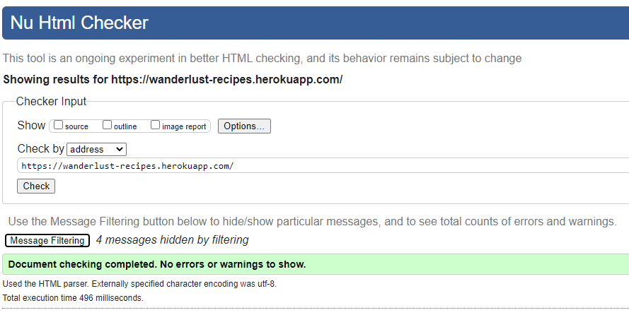

add-recipe.html

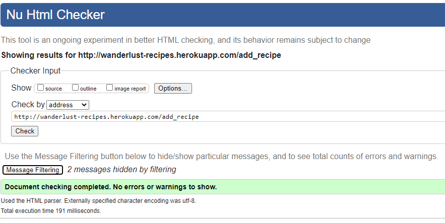

edit-categories.html

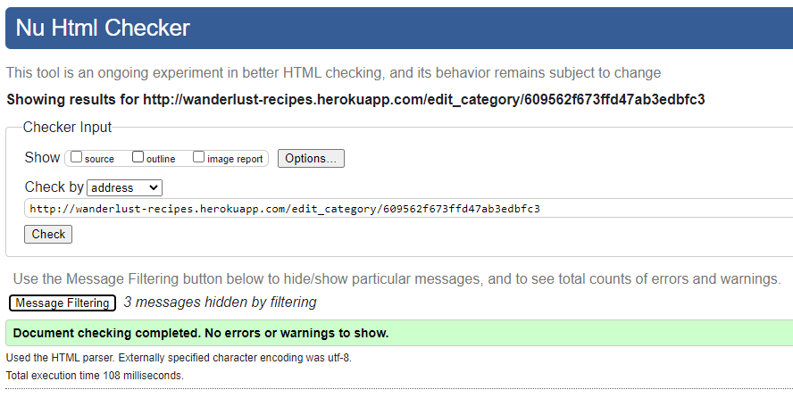

edit-recipe.html

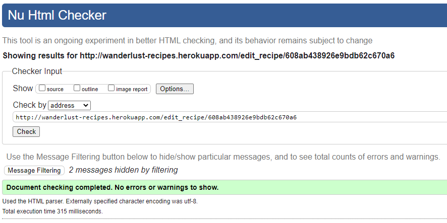

login.html

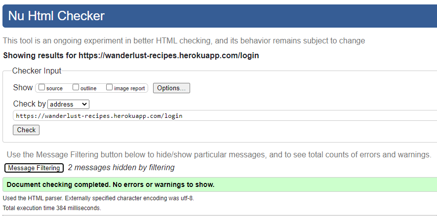

manage-categories.html

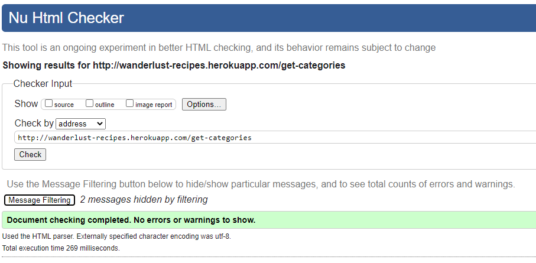

profile.html

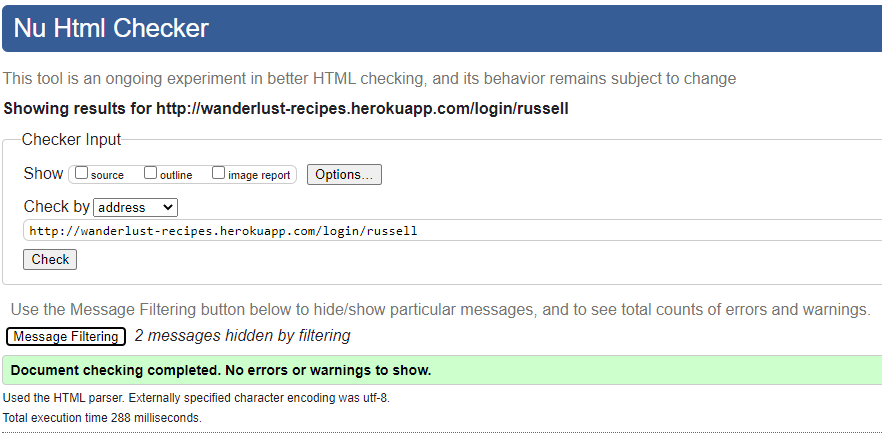

recipe-details.html

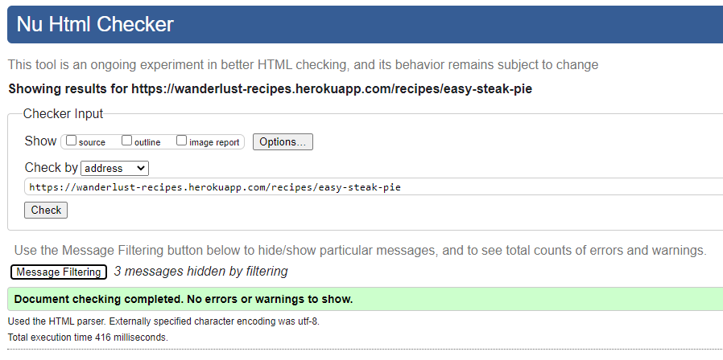

register.html

search.html

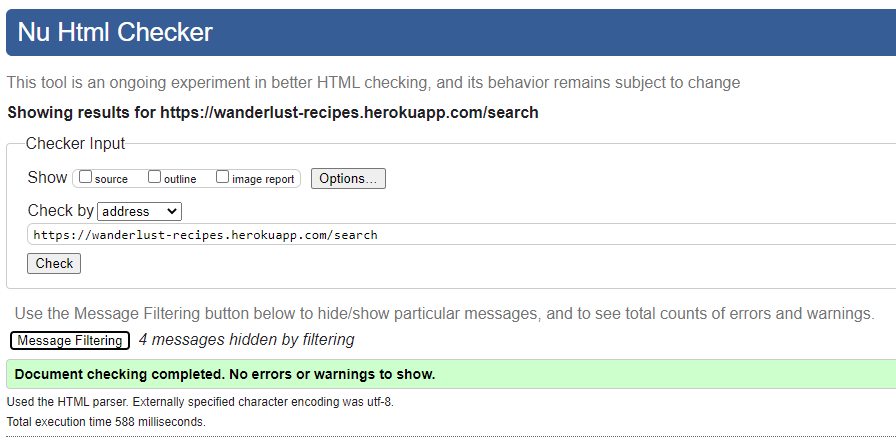

**Warnings**
All pages showed warnings regarding HTML semantics and use H2-6's in sections, however upon review I am happy that all headings are relevant for page layout. So I decided not to enact any changes.

H2-6 Warning

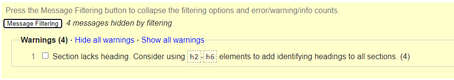

### W3 CSS

I validated the CSS with the [w3 Validation Service](https://jigsaw.w3.org/css-validator/) and it found no errors.

CSS Validation

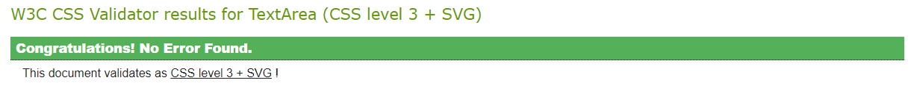

### JavaScript

I validated the JavaScript with [JSHint](https://jshint.com/).

Script.js

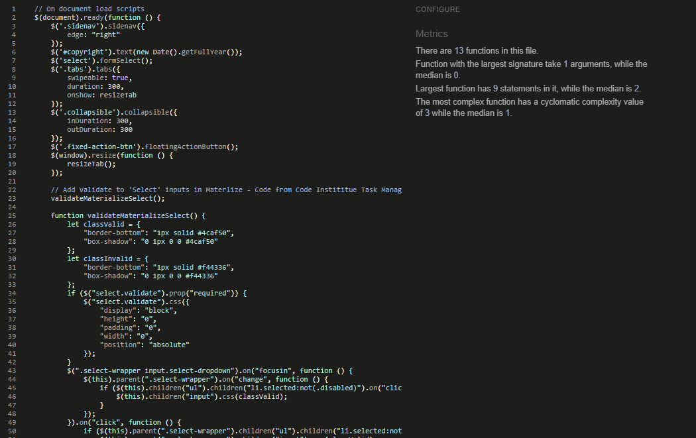

ajax-form-submission.js

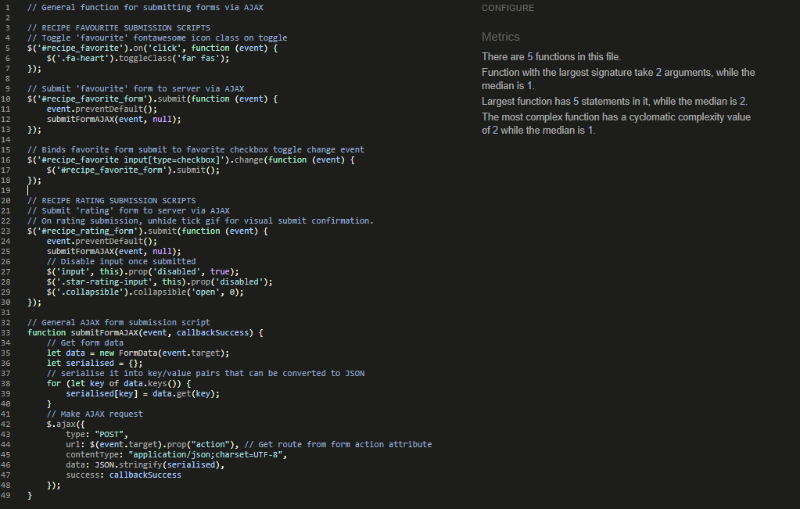

created-on-timestamp.js

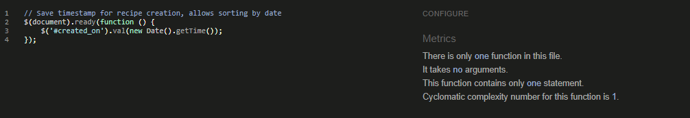

recipe-image-upload.js

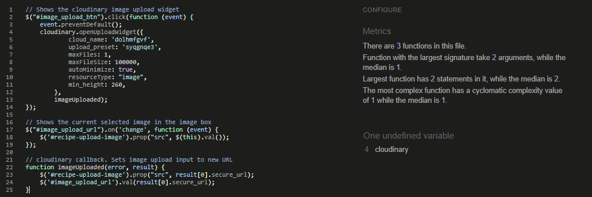

  The recipe-image-upload flagged an inaccurate issue with an undefined variable, however this is because the variable is called from a third-party application (cloudinary).

### Python

I validated the Python code with the [Pylint Validation Tool](https://www.pylint.org/), which found a number of simple errors I corrected.
The final validation marks are below, scoring 10/10 for all files.

app.py

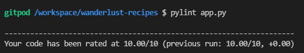

user_management.py

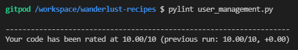

user_rating.py

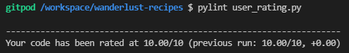

**Warnings and Errors Fixed**
On initial running of pylint, it flagged that I had not included Docstring descriptions for each of my functions, as I had used '#' notes instead. Additionally Pylint flagged a few occasions of poor syntax, such as imbalanced returns and use of unnecessary 'else' statements.
Based off Pylints feedback, I corrected these issues quickly and easily.

**.pylintrc**
After the above corrections, Pylint was still displaying a handful of warnings related to the app.py file, however these were false positive results for the following reasons:

app.py - inaccurate warnings

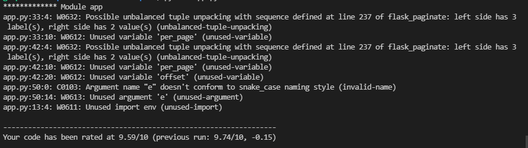

 - unbalanced-tuple-unpacking & unused-variable (per_page, offset): This relates to code used by flask-paginate to automate content pagination. The code was taken directly from their own installation guide, changes to the code causes the site to fail on page load.
 - invalid-name & unused-argument: 'e' is an accepted variable, used to capture errors in error handling functionality.
 - unused-import: 'env' is the local file used to configure the development environment, as it is not pushed to live via .gitignore, pylint is incorrectly believing the function is not used.

To clean up these false positives, I created a .pylintrc file and added the below rules to allow for these warning instances. By doing so, my app.py file now returns 10/10 score.

.pylintrc

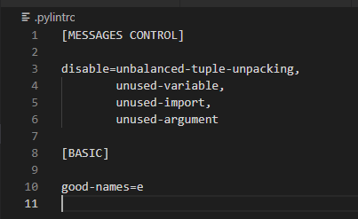

### Google Lighthouse Audit

I used Google's lighthouse audit to test the website conforms positively with Google's performance metrics, intending to achieve scores of 90% in all areas on desktop.

## Responsive Device & Browser Testing

To test the responsiveness of the site I used [Chrome DevTools](https://developers.google.com/web/tools/chrome-devtools), [Responsive Design Checker](https://www.responsivedesignchecker.com/) and [Lambdatest](https://www.lambdatest.com/).

### Responsiveness

To ensure responsive I used bootstrap, flexbox methods and containers to ensure all site pages resized responsively for all device viewports.

### Browser Compatibility

## Testing User Stories

## Issues I had to overcome

## Issues still to overcome

