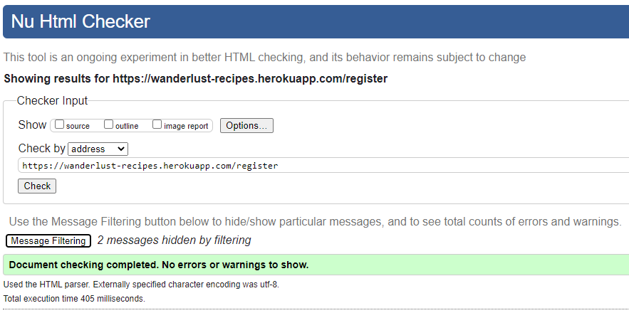

# Wanderlust Recipes Testing

- [Validation](#validation)
  * [W3 HTML](#w3-html)
  * [W3 CSS](#w3-css)
  * [JavaScript](#javascript)
  * [Python](#python)
  * [Google Lighthouse Audit](#google-lighthouse-audit)
- [Responsive Device & Browser Testing](#responsive-device--browser-testing)
  * [Responsiveness](#responsiveness)
  * [Browser Compatibility](#browser-compatibility)
- [Testing User Stories](#testing-user-stories)
- [Issues I had to overcome](#issues-i-had-to-overcome)
- [Issues still to overcome](#issues-still-to-overcome)

## Validation

### W3 HTML

I validated the HTML with [W3 Validation Service](https://validator.w3.org/). The results can be seen below;

<details>
<summary>base.html & recipes.html</summary>


</details>
<details>
<summary>add-recipe.html</summary>


</details>
<details>
<summary>edit-categories.html</summary>


</details>
<details>
<summary>edit-recipe.html</summary>


</details>
<details>
<summary>login.html</summary>


</details>
<details>
<summary>manage-categories.html</summary>


</details>
<details>
<summary>profile.html</summary>


</details>
<details>
<summary>recipe-details.html</summary>


</details>
<details>
<summary>register.html</summary>


</details>
<details>
<summary>search.html</summary>


</details>

**Warnings**

All pages showed warnings regarding HTML semantics and lacking use of H2-6's, however upon review I am happy that all headings are relevant for page layout. So I decided not to enact any changes.

<details>
<summary>H2-6 Warning</summary>


</details>

### W3 CSS

I validated the CSS with the [W3 Validation Service](https://jigsaw.w3.org/css-validator/) and it found no errors.

<details>
<summary>CSS Validation</summary>


</details>

### JavaScript

I validated the JavaScript with [JSHint](https://jshint.com/).

<details>
<summary>Script.js</summary>


</details>
<details>
<summary>ajax-form-submission.js</summary>


</details>
<details>
<summary>created-on-timestamp.js</summary>


</details>
<details>
<summary>recipe-image-upload.js</summary>


</details>

  The recipe-image-upload flagged an inaccurate issue with an undefined variable, however, this is because the variable is called from a third-party application (Cloudinary).

### Python

I validated the Python code with the [Pylint Validation Tool](https://www.pylint.org/), which found several simple errors I corrected.
The final validation marks are below, scoring 10/10 for all files.

<details>
<summary>app.py</summary>


</details>
<details>
<summary>user_management.py</summary>


</details>
<details>
<summary>user_rating.py</summary>


</details>

**Warnings and Errors Fixed**

On the initial running of Pylint, it flagged that I had not included Docstring descriptions for each of my functions, as I had used hashtag marked notes instead. Additionally, Pylint flagged a few occasions of poor syntaxes, such as imbalanced returns and the use of unnecessary 'else' statements.
Based on Pylints feedback, I corrected these issues quickly and easily.

**.pylintrc**

After the above corrections, Pylint was still displaying a handful of warnings related to the app.py file, however, these were false-positive results for the following reasons:

<details>
<summary>app.py - inaccurate warnings</summary>


</details>

 - unbalanced-tuple-unpacking & unused-variable (per_page, offset): 
      This relates to code used by flask-paginate to automate content pagination. The code was taken directly from their installation guide, changes to the code cause the site to fail on page load.
 - invalid-name & unused-argument: 
      'e' is an accepted variable, used to capture errors in error handling functionality.
 - unused-import: 
      'env' is the local file used to configure the development environment, as it is not pushed to live via .gitignore, pylint incorrectly believes the function is not used.

To clean up these false positives, I created a .pylintrc file and added the below rules to allow for these warning instances. By doing so, my app.py file now returns a 10/10 score.

<details>
<summary>.pylintrc</summary>


</details>


### Google Lighthouse Audit

I used Google's lighthouse audit to test the website conforms positively with Google's performance metrics, with the intent to achieve scores of 90% in all areas on desktop.

After running the audit, the site received the below scores;


This shows 90%+ scores for accessibility and best practices, but sub 90% in performance and SEO. 
Upon checking the reasoning for the low Performance and SEO scores, I decided to not take further action to improve the scores for the below reasons;

<details>
<Summary>Performance</Summary>


The driving factors to the low-performance score are the 'Eliminate Render Blocking Resources' and 'Remove Unused JavaScript'. However, the sources driving these are external resources, such as Materialize and jQuery. Therefore as the underlying cause is due to third party scripts, no further on-site optimisation is suitable.

</details>
<details>
<Summary>SEO</Summary>


The two driving factors in the low SEO score are 'uncrawlable links' and 'robots.txt is not valid'. 
The uncrawable links are the pagination links on the recipes page, which are auto-generated by flask-pagination. These links are not necessarily needed for crawling, as a properly optimised robots.txt file will ensure each recipe page (recipe-details) would be crawled by search engines.

The invalid robots.txt is being flagged, as no robots.txt file has been created. The purpose of a robots.txt file to provide search engines information on your site and directions on how to crawl your pages.  If this project were for commercial or public purposes, an optimised robots.txt file would be an important inclusion. 

However, as this is a personal project, not meant for discovery on search engines, no robots.txt should be created.

</details>

## Responsive Device & Browser Testing

To test the responsiveness of the site I used [Chrome DevTools](https://developers.google.com/web/tools/chrome-devtools), [Responsive Design Checker](https://www.responsivedesignchecker.com/) and [Lambdatest](https://www.lambdatest.com/).

### Responsiveness


To ensure responsive design, I used materialize grid, flexbox, containers and custom media queries to ensure all site pages resized responsively for all mainstream device viewports.

### Browser Compatibility


Through testing, I found images in 'WebP' format would not display on some Safari desktop browser versions, this is because [Safari only supports WebP image format in version 14 onwards](https://www.keycdn.com/support/webp-browser-support#:~:text=Safari%20will%20support%20WebP%20in,almost%20be%20completely%20globally%20supported.). As version 14 was only released in September 2020, I opted to convert the images to png and re-upload, ensuring wider compatibility.

Additionally, the site does not load properly while using Internet Explorer, due to issues with Materialize CSS compatibility.

According to [caniuse](https://caniuse.com/usage-table) the current usage of Internet Explorer is just 0.9% of total browser users, therefore I am comfortable not supporting IE in the site design.

Note: Microsoft released Internet Explorer in 2013 and ceased active development in 2015 when Microsoft Edge was released as the replacement, as evidenced by this article from Microsoft's design team. Since 2015 Microsoft has been actively encouraging users to adopt Edge over Explorer, with the only remaining updates for IE, being security patches and bug fixes.

## Testing User Stories
<details>
<summary>Browsing</summary>

* **\(US001\)** - As a user I want the website to display recipe suggestions to me so I can be introduced to new content.
   - When a user visits the website, the first page they visit displays the latest recipes added to the site and a search function, to browse for specific recipes the user may wish to find.
   - When a user logs in to their account, their profile page displays their favourited recipes and uploaded recipes.
* **\(US002\)** - As a user I want to see recipe reviews and comments from other users, so I am informed of the best recipes.
   - Users can comment on recipes they view, providing feedback as needed.
   - Users can delete their own comments.
   - Admins have ability to delete any comments.
</details>
<details>
<summary>Searching</summary>

* **\(US003\)** - As a user, I want to be able to view recipes by category, so I can find recipes of specific type I would like to make.
   - The search function on the home page allows users to filter recipes by category.
* **\(US004\)** - As a user, I want to be able to search recipes by keyword, so I can find recipes easily, for example by name or by included ingredient.
   - The search function on the home page allows users to search recipes by keyword. This function will search through the indexed recipe_title, category_name and ingredients, elements of the recipes database category.
* **\(US005\)** - As a user, I want to be able to search and filter recipes by rating, so I can find only the highest-rated recipes to choose from.
   - The search function on the home page allows users to filter recipes by minimum rating.
* **\(US006\)** - As a user, I want to be able to search and filter recipes by serving size, so I can find recipes suited to the number of people I am catering to.
   - The search function on the home page allows users to filter recipes by serving size.
* **\(US007\)** - As a user, I want to be about to save my favourite recipes, so I can quickly find them again in future.
   - On each recipe page, there is a heart logo in the top right of the recipe image - toggling the heart to appear filled adds this recipe to user favourites.
</details>

<details>
<summary>Uploading Recipes</summary>

* **\(US008\)** - As a user, I want to be able to upload my recipes, so other users can benefit from them.
   - Logged-in users can add new recipe's to the site via the link in the navigation bar. The form input fields inform the user of the required information.
* **\(US009\)** - As a user, I want to gain feedback on the recipes I upload, so I can determine improvements.
   - Recipes uploaded to the site can be rated by other users, so users will be able to see the current star rating of their uploaded recipes.
* **\(US010\)** - As a user, I want to be able to edit and improve recipes I have already uploaded.
   - Logged in users can edit their uploaded recipes via the 'uploaded' list on their user profile page.
* **\(US011\)** - As a user, I want to be able to delete recipes I have already uploaded.
   - Logged in users can delete their uploaded recipes via the 'edit recupe' page of the relevant recipe.
</details>

<details>
<summary>Users</summary>

* **\(US012\)** - As a user, I want to be able to register with the site, so I can upload and edit recipes, plus save my favourite recipes.
   - Users can register as user profile via the 'registration' page, which informs users of the required username and password formatting.
* **\(US013\)** - As a registered user, I want to be able to log in to my account, so I can access and edit my recipes, and find my favourite recipes.
   - Users with registered accounts can log in to their account via the 'Login' page, using their registered username and password.
* **\(US014\)** - As a registered user, I want to be able to submit ratings and reviews for recipes submitted by other users.
   - Logged in users can submit star ratings for recipes via viewing the recipe detail pages. If you have previously rated a recipe, your previous rating score will display.
</details>

<details>
<summary>Administration</summary>

* **\(US015\)** - As an admin, I want to be able to edit and delete content, to ensure it adheres to site rules.
   - If the logged-in user has the role of 'admin' the 'uploaded' list is replaced with a list of all recipes, this allows the admin to edit all recipes added to the site.
* **\(US-16\)** - As an admin I want to be able to add and edit food categories, to continuously improve user experience.
   - If the logged-in user has the role of 'admin', the 'Manage Categories' link will be visible in the navigation bar. The 'Manage Categories' page shows all categories added to the site, plus options to edit and delete them.
* **\(US-17\)** - As an admin I want to be able to delete food categories, to continuously improve user experience.
</details>

<details>
<summary>General</summary>

* **\(US018\)** - As a user, I want to receive clear feedback for my actions on the site, so I know they are complete or if further steps are needed.
   - Where appropriate, visual responses have been added to confirm the success or failure of user interaction events, including;
      - When a user registers with the site, a flash message is shown advising on successful/failed registration.
      - When a user logs in to the site, a flash message is shown welcoming the user to their login page, showing their username. If login is unsuccessful, a flash message shows advising so.
      - When a user adds a new recipe to the site or edits an existing recipe, a flash message is displayed advising of a successful/failed update.
      - When a user rates a recipe, a gif is displayed showing successful submission of their rating.
      - When a user favourites a recipe, the heart logo displays in a 'filled' state, indicating the recipe is on the users' favourite list.
</details>
&nbsp;

## Issues I had to overcome
- **User Image Upload**:

   I had two options for enabling users to provide recipe images;
    1. Allow users to provide a text URL to an online image
    2. Embed image upload functionality to the site. 

   The first option is the easiest, as would only require saving a form text string to the database. However this does not provide as fluid a user experience as allowing users to upload the image directly to the site, therefore I chose the second option.

   Rather than code the functionality myself, I found a third party widget I can embed into the site from [Cloudinary](https://cloudinary.com/).

   To install the widget to the site, I had to add the widget script tag to the add and edit recipe pages;

   <details>
   <summary>Cloudinary Widget Script</summary>

   ```
   <script src="//widget.cloudinary.com/global/all.js" type="text/javascript"></script>
   ```
   </details>

   I then had to create a button, with an attached event listener, which calls the widget. The Cloudinary widget also allows easy customisation, so I have restricted the image type to 'image', file size to 1MB, file number to one and minimum image height to 260 pixels.

   <details>
   <summary>Widget eventListener</summary>
   
   ```
   // Shows the cloudinary image upload widget
   $("#image_upload_btn").click(function (event) {
      event.preventDefault();
      cloudinary.openUploadWidget({
               cloud_name: 'dolhmfgvf',
               upload_preset: 'syqgnqe3',
               maxFiles: 1,
               maxFileSize: 100000,
               autoMinimize: true,
               resourceType: "image",
               min_height: 260,
         },
         imageUploaded);
   });
   ```
   </details>

   While the image is saved to Cloudinary's cloud storage, the new URL for the stored image needs to be saved to the add/edit recipe form and saved to the database, so it can be recalled later. This was done using the below scripts;

   <details>
   <summary>Set form input to uploaded image URL</summary>
   
   ```
   // cloudinary callback. Sets image upload input to new URL
   function imageUploaded(error, result) {
    $('#recipe-upload-image').prop("src", result[0].secure_url);
    $('#image_upload_url').val(result[0].secure_url);
   }
   ```
   </details>

   To allow a positive user experience and feedback that the image has uploaded successfully, the below script also updates the image container on-page, to display your uploaded image;

   <details>
   <summary>Update on page image, to user uploaded image</summary>
   
   ```
   // Shows the current selected image in the image box
   $("#image_upload_url").on('change', function (event) {
      $('#recipe-upload-image').prop("src", $(this).val());
   });   
   ```
   </details>


- **Materialize Tab Resizing**

   By default, the ['Tab' carousel function provided by Materlize](https://materializecss.com/tabs.html), is limited to a maximum height of 400 pixels. This was causing issues where long ingredient or method step lists, were being visually cut short, as below;

   

   To fix this, I had to add the below CSS and JavaScript. The CSS causes the .carousel-content containing to auto-set its height to fit its content. The JavaScript sets the parent div of .tabs-content to the calculated height of the content in pixels.

   <details>
   <summary>CSS & JS to resize Materialize Tabs</summary>
   
   CSS: 
   ```
   .tabs-content.carousel .carousel-item {
    height: auto;
   }  
   ```
   JavaScript:
   ```
   function resizeTab() {
    $(".tabs-content").css('height', $('.carousel-item.active').height() + 'px');
   }
   ```
   </details>

   This solution was found on [this](https://github.com/Dogfalo/materialize/issues/4159#issuecomment-387969837) GitHub thread.

- Favourite Form Submission - AJAX

   By default, using the method 'POST' to save information to the database, would cause the browser pages to reload. This is not the best user experience for interactions such as favouriting or rating a viewed recipe, as it would interrupt the viewing experience.
   An improved experience would be to save this information to the database, without reloading the page. 
   
   To accomplish this I incorporated JavaScript AJAX form submission into the application.

   Below is the jQuery script I used to create general AJAX submissions from HTML form data.
   
   I used [this](https://www.digitalocean.com/community/tutorials/submitting-ajax-forms-with-jquery) guide from Digital Ocean and [this](https://github.com/seanyoung247/Plum/blob/main/static/js/script.js) application created by Sean Young, to help create the script and adapt it to JSON format for submission to MongoDB.

   <details>
   <summary>General AJAX form submission script</summary>
   
   ```
   function submitFormAJAX(event, callbackSuccess) {
    // Get form data
    let data = new FormData(event.target);
    let serialised = {};
    // serialise it into key/value pairs that can be converted to JSON
    for (let key of data.keys()) {
        serialised[key] = data.get(key);
    }
    // Make AJAX request
    $.ajax({
        type: "POST",
        url: $(event.target).prop("action"), // Get route from form action attribute
        contentType: "application/json;charset=UTF-8",
        data: JSON.stringify(serialised),
        success: callbackSuccess
    });
   }
   ```
   </details>

   With the submitFormAJAX function created, I had to bind event listeners to the relevant form submits - below is the eventListener for the favourite toggle;

   <details>
   <summary>Favourite Toggle Event Listener</summary>
   
   ```
   // Binds favorite form submit to favorite checkbox toggle change event
   $('#recipe_favorite input[type=checkbox]').change(function (event) {
      $('#recipe_favorite_form').submit();
   });
   ```
   </details>

   As mentioned earlier, the default action on submission for this form would be to POST to the database and reload the page, this needs to be prevented in favour of submitting via AJAX submission. This is handled for the favourite toggle in the below script;

   <details>
   <summary>Prevent Default POST action, in favour of calling AJAX submission function</summary>
   
   ```
   // Submit 'favourite' form to server via AJAX
   $('#recipe_favorite_form').submit(function (event) {
      event.preventDefault();
      submitFormAJAX(event, null);
   });
   ```
   </details>

**Pagination**:

   To future proof the site, pagination is an important feature. As more recipes are added to the site, the number of recipe summaries to load on the home page would increase exponentially, leading to a slow down in page load speed.
   By adding pagination, we can keep the number of recipe summaries loaded on each page is low, ensuring quick page load speeds.

   To add pagination, I used the 'flask-paginate' extension and the following [GitHub guide](https://gist.github.com/mozillazg/69fb40067ae6d80386e10e105e6803c9) for implementation.

**Edit Recipe form POSTing when Cloudinary widget called**:

   During development I encountered an odd issue where clicking the 'Upload Image' button on the 'Edit Recipe' page would POST the entire edit recipe form to the database, instead of calling just the Cloudinary widget.
   This is despite the same HTML and JavaScript being used on the 'New Recipe' page and functioning as desired.

   I hypothesise that the issue was because the widget was firing a 'method == "POST"' event when called, which was triggering the 'edit_recipe()' function in app.py to be called.

   To rectify this I added a 'eventpreventDefault()' function call to the 'cloudinary.openUploadWidget()' function. This prevents the default action of the 'edit_recipe()', therefore prevening application POSTing to the database. This then allowed the widget to be opened without issue and the user to upload a new image.

**WebP format and Safari browsers**

   During the responsive design testing, I noticed a number of the recipe images were not loading. After investigation, I determined this was because Safari, before version 14.0 (released Sept 2020), did not support the WebP image format.

   To rectify this I manually updated all images to .png file formats and updated the database. I also updated the Cloudinary account settings, to automatically convert all uploaded image files to PNG format, to ensure future compliance.

## Issues still to overcome
**Forgotten Password**:

   Currently, there is no function to help users recover a password if it is forgotten. This can be added in the future, via the integration of an e-mail system to send users account verification and reset password links.

**User/Admin search and pagination Function**:

   Currently, the user profile page renders all favourited and user-uploaded recipes, which could cause issues in page load speed as a user account matures and the number of recipes per list increase.
   A future resolution to this would be to add pagination to the Favourite and Uploaded recipe lists, while also adding in 'search' functionality to the profile page, so users can quickly find specific recipes.

   This is a more pressing issue for users with the role 'admin' as their 'uploaded' list will currently load all recipes, to allow admins to edit and delete as needed.

